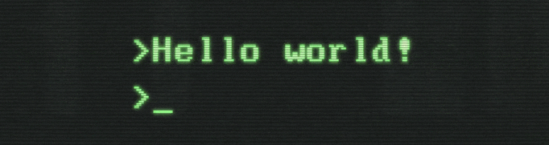

<!--

https://miro.medium.com/max/2400/1*OohqW5DGh9CQS4hLY5FXzA.png 
https://hackernoon.com/images/f2px36fy.gif
https://camo.githubusercontent.com/2309797487e5e969659a3b545c96151807b04120a9cc2985f632ec94ba00c9f3/68747470733a2f2f6d656469612e67697068792e636f6d2f6d656469612f53576f536b4e36447854737a71494b4571762f67697068792e676966

-->

## 
🇫🇷 Pwn, RE, malware and stitch ! 🕵️‍♂️

 <!--

  
  
  
  
  
  
  
  
  
  
  
  
  
  
  
  
  
  
  
  
  
  
  
  

  
-->
--------

  
 

--------

<!--
https://hshrzd.wordpress.com/how-to-start/

https://malwareunicorn.org/workshops/re101#2
